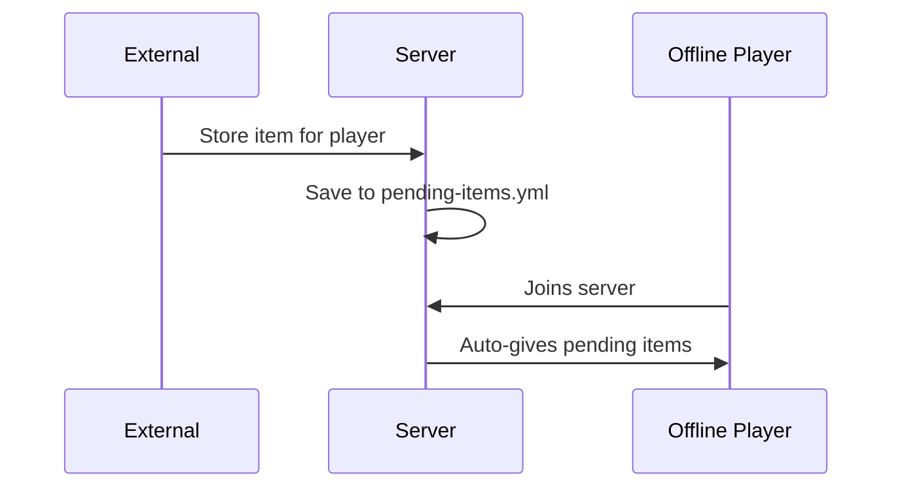

# 🎮 Edwige - Minecraft Paper Plugin

A feature-rich Minecraft server plugin for Paper 1.21+ with REST API integration, player item redemption, and
interactive chat-based verifications.

---

## 📋 Overview

| Property        | Value        |
|-----------------|--------------|
| **Name**        | Edwige       |
| **Version**     | 1.0-SNAPSHOT |
| **API Version** | 1.21         |
| **Platform**    | PaperMC      |

---

## ✨ Features

### 🔐 REST API Server

Built-in HTTP server with **Bearer Token authentication** for secure external integrations.

```
graph LR
    A -- [External Service] -- [POST] /api/validate-registration"--> B [API Server]
    A --[POST] /api/execute --> B
    A --[GET] /api/info--> B
    B --Bearer Token--> A
```

#### API Endpoints

| Endpoint                     | Method | Description                                           |
|------------------------------|--------|-------------------------------------------------------|
| `/api/info`                  | GET    | Server statistics (players online, max players, etc.) |
| `/api/execute`               | POST   | Execute console commands remotely                     |
| `/api/validate-registration` | POST   | Trigger player verification via in-game prompt        |

#### Configuration

```yaml
security:
  bearerToken: "change-me"  # Your secret token
api:
  port: 8082                # API server port
```

---

### 📦 Pending Item Redemption

Players can receive items while offline and redeem them when they join.



#### Features:

- **Automatic delivery** on player join
- **Manual redemption** via `/redeem` command
- **Inventory validation** - checks available slots before giving items
- **Persistent storage** in `pending-items.yml`

---

#### Flow:

1. External system sends verification request via API
2. Player receives styled in-game message with clickable buttons
3. Player clicks ✔ (Confirm) or ✖ (Deny)
4. Callback sent back to the external website

---

### 🎮 Commands

| Command   | Permission              | Description                   |
|-----------|-------------------------|-------------------------------|
| `/redeem` | `edwige.command.redeem` | Redeem pending items manually |

---

## 📁 Project Structure

```
src/main/java/io/realmit/edwige/
├── Main.java                          # Plugin entry point
├── api/
│   ├── http/
│   │   ├── ApiServer.java             # HTTP server
│   │   ├── handlers/                  # Request handlers      A)
│   │   ├── utils/                     # HTTP utilities
│   │   └── enums/                     # HTTP enums
│   ├── controllers/                   # MVC controllers       B)
│   ├── services/                      # Business logic        C)
│   ├── dto/                           # Data transfer objects
│   ├── listeners/                     # Event listeners
│   └── callbacks/                     # HTTP callback clients
├── commands/                          # In-game commands
└── services/
    ├── ChatQuestionService.java       # Chat-based prompts
    ├── MessageService.java            # Message handling
    └── PlayerActionsService.java      # Player actions
```

---

## 🎨 UI/UX Features

### Styled Messages (MiniMessage)

- **Colored text** support
- **Clickable buttons** for Yes/No responses
- **Chat clearing** before important prompts
- **Customizable** via `messages.yml`

### Example Messages

```yaml
# Registration prompt
title: "Account Registration Request"
question: "A website registration was attempted for your account."
prefix:
  0: "Email: "
  1: "IP Address: "
buttons:
  confirm: "CONFIRM"
  deny: "DENY"
```

---

## 🔒 Security

- **Bearer Token Authentication** on all API endpoints
- **Input Validation** - validates all JSON request fields
- **HTTP Status Codes** - proper error responses (400, 401, 405)
- **Command Sanitization** - strips leading `/` from console commands

---

## 🚀 Getting Started

1. **Configure** the `config.yml` with your bearer token and API port
2. **Customize** messages in `messages.yml`
3. **Start** the server - API starts automatically on port `8082`
4. **Integrate** with your website using the REST API

---

## 📦 Dependencies

- **PaperMC 1.21+** - Server platform
- **Adventure API** - Modern chat component API
- **Jackson** - JSON serialization
- **MiniMessage** - Rich text formatting

---

*Plugin developed with ❤️ using modern Java patterns (MVC, Services, DTOs)*
